# Architecture — react-crud

## Diagram

<!-- Rendered SVG is generated by CI from architecture.mmd -->

## Data Flows

### Flow 1 — Fetch users (read)
`UserList.jsx` → dispatches `fetchUsers()` → async thunk in `usersSlice.js` →
`fetchWithRetry()` → **GET** `jsonplaceholder.typicode.com/users` → response
populates `state.users.entities` in `store.js` → `useSelector` triggers re-render.

### Flow 2 — Add user (local write)
`AddUser.jsx` → dispatches `userAdded(payload)` → synchronous reducer pushes to
`entities` → store update → `UserList.jsx` re-renders on navigation to `/`.

### Flow 3 — Delete user (local write)
`UserList.jsx` → dispatches `userDeleted({ id })` → reducer filters `entities` →
store update → component re-renders in place.