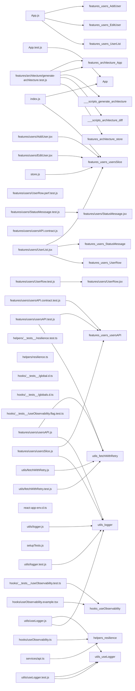

# Architecture Diagram

> Auto-generated — do not edit by hand.  
> Last updated: 2026-03-31T07:14:22.173Z

```mermaid
flowchart LR
  App_js["App.js"]
  App_test_js["App.test.js"]
  features_architecture_generate_architecture_test_js["features/architecture/generate-architecture.test.js"]
  features_users_AddUser_jsx["features/users/AddUser.jsx"]
  features_users_EditUser_jsx["features/users/EditUser.jsx"]
  features_users_StatusMessage_jsx["features/users/StatusMessage.jsx"]
  features_users_StatusMesssage_test_js["features/users/StatusMesssage.test.js"]
  features_users_UserList_jsx["features/users/UserList.jsx"]
  features_users_UserRow_jsx["features/users/UserRow.jsx"]
  features_users_UserRow_perf_test_js["features/users/UserRow.perf.test.js"]
  features_users_UserRow_test_js["features/users/UserRow.test.js"]
  features_users_usersAPI_contract_js["features/users/usersAPI.contract.js"]
  features_users_usersAPI_contract_test_js["features/users/usersAPI.contract.test.js"]
  features_users_usersAPI_js["features/users/usersAPI.js"]
  features_users_usersAPI_test_js["features/users/usersAPI.test.js"]
  features_users_usersSlice_js["features/users/usersSlice.js"]
  helpers___tests___resilience_test_ts["helpers/__tests__/resilience.test.ts"]
  helpers_resilience_ts["helpers/resilience.ts"]
  hooks___tests___global_d_ts["hooks/__tests__/global.d.ts"]
  hooks___tests___globals_d_ts["hooks/__tests__/globals.d.ts"]
  hooks___tests___useObservability_flag_test_ts["hooks/__tests__/useObservability.flag.test.ts"]
  hooks___tests___useObservability_test_ts["hooks/__tests__/useObservability.test.ts"]
  hooks_useObservability_example_tsx["hooks/useObservability.example.tsx"]
  hooks_useObservability_ts["hooks/useObservability.ts"]
  index_js["index.js"]
  react_app_env_d_ts["react-app-env.d.ts"]
  services_api_ts["services/api.ts"]
  setupTests_js["setupTests.js"]
  store_js["store.js"]
  utils_fetchWithRetry_js["utils/fetchWithRetry.js"]
  utils_fetchWithRetry_test_js["utils/fetchWithRetry.test.js"]
  utils_logger_js["utils/logger.js"]
  utils_logger_test_js["utils/logger.test.js"]
  utils_useLogger_js["utils/useLogger.js"]
  utils_useLogger_test_js["utils/useLogger.test.js"]
  App_js --> features_users_AddUser
  App_js --> features_users_EditUser
  App_js --> features_users_UserList
  App_test_js --> App
  features_architecture_generate_architecture_test_js --> features_architecture_App
  features_architecture_generate_architecture_test_js --> features_architecture_App
  features_architecture_generate_architecture_test_js --> ___scripts_generate_architecture
  features_architecture_generate_architecture_test_js --> ___scripts_architecture_diff
  features_architecture_generate_architecture_test_js --> features_architecture_store
  features_users_AddUser_jsx --> features_users_usersSlice
  features_users_EditUser_jsx --> features_users_usersSlice
  features_users_StatusMesssage_test_js --> features_users_StatusMessage_jsx
  features_users_UserList_jsx --> features_users_usersSlice
  features_users_UserList_jsx --> features_users_StatusMessage
  features_users_UserList_jsx --> features_users_UserRow
  features_users_UserRow_test_js --> features_users_UserRow_jsx
  features_users_usersAPI_contract_test_js --> features_users_usersAPI
  features_users_usersAPI_js --> utils_fetchWithRetry
  features_users_usersAPI_js --> utils_logger
  features_users_usersAPI_test_js --> features_users_usersAPI
  features_users_usersAPI_test_js --> utils_fetchWithRetry
  features_users_usersSlice_js --> features_users_usersAPI
  features_users_usersSlice_js --> utils_logger
  hooks___tests___useObservability_test_ts --> hooks_useObservability
  hooks_useObservability_example_tsx --> hooks_useObservability
  hooks_useObservability_ts --> helpers_resilience
  index_js --> App
  index_js --> features_users_usersSlice
  services_api_ts --> helpers_resilience
  store_js --> features_users_usersSlice
  utils_fetchWithRetry_js --> utils_fetchWithRetry
  utils_fetchWithRetry_test_js --> utils_fetchWithRetry
  utils_logger_js --> utils_logger
  utils_logger_test_js --> utils_logger
  utils_useLogger_js --> utils_useLogger
  utils_useLogger_js --> utils_logger
  utils_useLogger_test_js --> utils_useLogger
  utils_useLogger_test_js --> utils_useLogger
```
